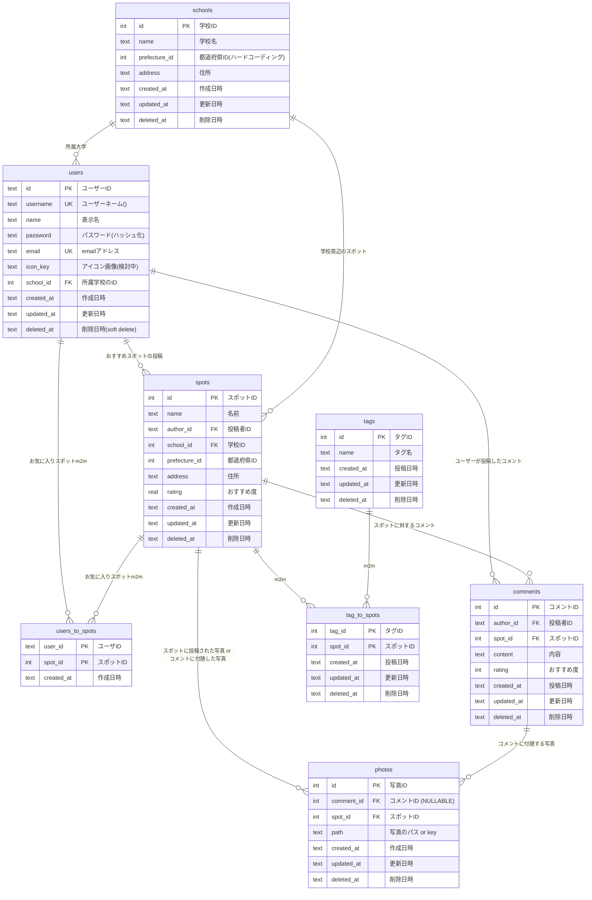

```mermaid
erDiagram
users {
    text id PK "ユーザーID"
    text username UK "ユーザーネーム()"
    text name "表示名"
    text password "パスワード(ハッシュ化)"
    text email UK "emailアドレス"
    text icon_key "アイコン画像(検討中)"
    int school_id FK "所属学校のID"
    text created_at "作成日時"
    text updated_at "更新日時"
    text deleted_at "削除日時(soft delete)"
}

schools {
    int id PK "学校ID"
    text name "学校名"
    int prefecture_id "都道府県ID(ハードコーディング)"
    text address "住所"
    text created_at "作成日時"
    text updated_at "更新日時"
    text deleted_at "削除日時"
}

users_to_spots {
    text user_id PK "ユーザID"
    int spot_id PK "スポットID"
    text created_at "作成日時"
}

spots {
    int id PK "スポットID"
    text name "名前"
    text author_id FK "投稿者ID"
    int school_id FK "学校ID"
    int prefecture_id "都道府県ID"
    text address "住所"
    real rating "おすすめ度"
    text created_at "作成日時"
    text updated_at "更新日時"
    text deleted_at "削除日時"
}

comments { 
    int id PK "コメントID"
    text author_id FK "投稿者ID"
    int spot_id FK "スポットID"
    text content "内容"
    int rating "おすすめ度"
    text created_at "投稿日時"
    text updated_at "更新日時"
    text deleted_at "削除日時"
}

photos {
    int id PK "写真ID"
    int comment_id FK "コメントID (NULLABLE)"
    int spot_id FK "スポットID"
    text path "写真のパス or key"
    text created_at "作成日時"
    text updated_at "更新日時"
    text deleted_at "削除日時"
}

tags {
    int id PK "タグID"
    text name "タグ名"
    text created_at "投稿日時"
    text updated_at "更新日時"
    text deleted_at "削除日時"
}

tag_to_spots {
    int tag_id PK "タグID"
    int spot_id PK "スポットID"
    text created_at "投稿日時"
    text updated_at "更新日時"
    text deleted_at "削除日時"
}

users ||--o{ spots : "おすすめスポットの投稿"
users ||--o{ comments : "ユーザーが投稿したコメント"
users ||--o{ users_to_spots : "お気に入りスポットm2m"
schools ||--o{ spots : "学校周辺のスポット"
schools ||--o{ users : "所属大学"
spots ||--o{ comments : "スポットに対するコメント"
spots ||--o{ tag_to_spots : "m2m"
spots ||--o{ users_to_spots : "お気に入りスポットm2m"
spots ||--o{ photos : "スポットに投稿された写真 or コメントに付随した写真"
tags ||--o{ tag_to_spots : "m2m"
comments ||--o{ photos : "コメントに付随する写真"
```
