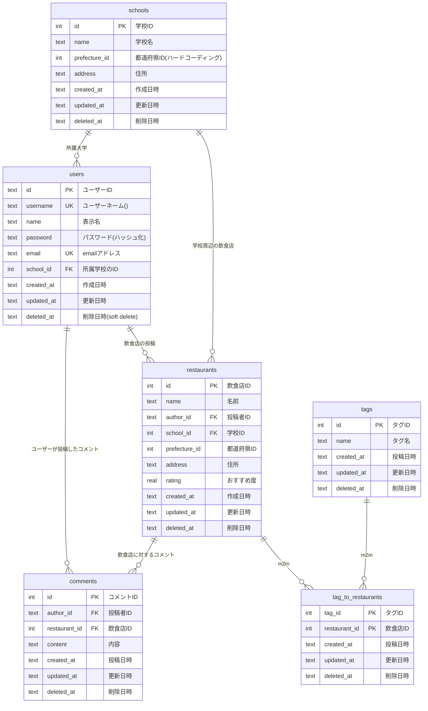

```mermaid
erDiagram
users {
    text id PK "ユーザーID"
    text username UK "ユーザーネーム()"
    text name "表示名"
    text password "パスワード(ハッシュ化)"
    text email UK "emailアドレス"
    int school_id FK "所属学校のID"
    text created_at "作成日時"
    text updated_at "更新日時"
    text deleted_at "削除日時(soft delete)"
}

schools {
    int id PK "学校ID"
    text name "学校名"
    int prefecture_id "都道府県ID(ハードコーディング)"
    text address "住所"
    text created_at "作成日時"
    text updated_at "更新日時"
    text deleted_at "削除日時"
}

restaurants {
    int id PK "飲食店ID"
    text name "名前"
    text author_id FK "投稿者ID"
    int school_id FK "学校ID"
    int prefecture_id "都道府県ID"
    text address "住所"
    real rating "おすすめ度"
    text created_at "作成日時"
    text updated_at "更新日時"
    text deleted_at "削除日時"
}

comments { 
    int id PK "コメントID"
    text author_id FK "投稿者ID"
    int restaurant_id FK "飲食店ID"
    text content "内容"
    text created_at "投稿日時"
    text updated_at "更新日時"
    text deleted_at "削除日時"
}

tags {
    int id PK "タグID"
    text name "タグ名"
    text created_at "投稿日時"
    text updated_at "更新日時"
    text deleted_at "削除日時"
}

tag_to_restaurants {
    int tag_id PK "タグID"
    int restaurant_id PK "飲食店ID"
    text created_at "投稿日時"
    text updated_at "更新日時"
    text deleted_at "削除日時"
}

users ||--o{ restaurants : "飲食店の投稿"
users ||--o{ comments : "ユーザーが投稿したコメント"
schools ||--o{ restaurants : "学校周辺の飲食店"
schools ||--o{ users : "所属大学"
restaurants ||--o{ comments : "飲食店に対するコメント"
restaurants ||--o{ tag_to_restaurants : "m2m"
tags ||--o{ tag_to_restaurants : "m2m"
```
